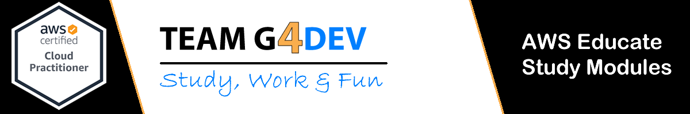

## :orange_book: Introduction

The AWS Certified Cloud Practitioner exam is intended for individuals who have the skills and knowledge necessary to effectively demonstrate a general understanding of how the AWS cloud works, regardless of the specific technical roles addressed by other AWS certifications. The exam can be taken at an exam center or from the comfort and convenience of home or office as an online supervised exam.

- Achieving this certification is an optional but recommended step to achieve an Associate or 

- Specialty level certification.

- Demonstrated skills with certification

- Define what is the AWS cloud and basic general infrastructure

- Describe basic architectural principles of the AWS cloud

- Describe the AWS cloud value proposition

- Describe the key services of the AWS platform and what are their common use cases (eg computation, analytics)

- Describe the security and compliance basics of the AWS platform and the shared security model

- Define billing, account management, and pricing models

- Identify sources of documentation or technical assistance (for example, technical documents or support tickets)

-Describe the basic / main characteristics of performing deployments and tasks in the AWS cloud

## :books: Content

- [Module 01 - Cloud Computing](Module_01_Cloud_Computing/)
- [Quizz - Module 01](Module_01_Cloud_Computing/Quizz_Module01/)

## Author

> :man: Carlos Andres **G**arcia Morales
> :octocat: [Github](https://github.com/agzsoftsi)

> :man: Orlando **G**omez Lopez
> :octocat: [Github](https://github.com/oran2527)

> :man: Diego **G**arzon
> :octocat: [Github](https://github.com/diesgaro)

> :man: Ivan Dario Lasso **G**il
> :octocat: [Github](https://github.com/ilasso)